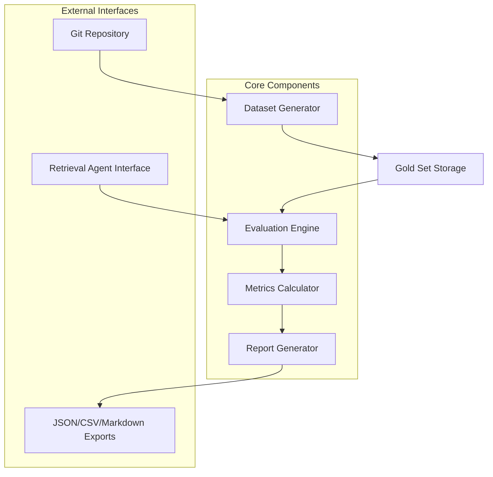

# Design Document

## Overview

The Code Search Benchmark System is a Python-based evaluation framework that automatically generates test datasets from Git repositories and measures the accuracy and speed of code retrieval systems. The system follows a pipeline architecture: Dataset Generation → Agent Evaluation → Metrics Calculation → Report Generation.

The design prioritizes extensibility (supporting multiple retrieval agents), reproducibility (deterministic test execution), and automation (minimal manual intervention).

## Architecture



### Component Responsibilities

1. **Dataset Generator**: Mines Git history, filters commits, generates queries
2. **Gold Set Storage**: Persists test cases in structured format
3. **Retrieval Agent Interface**: Abstract interface for pluggable search systems
4. **Evaluation Engine**: Orchestrates test execution and timing
5. **Metrics Calculator**: Computes F1 scores and latency statistics
6. **Report Generator**: Creates human-readable and machine-readable outputs

## Components and Interfaces

### 1. Dataset Generator

**Purpose**: Extract meaningful test cases from Git commit history

**Key Classes**:

```python
class CommitAnalyzer:
    def is_feature_commit(self, commit: Commit) -> bool
    def extract_modified_files(self, commit: Commit) -> List[str]
    def classify_complexity(self, file_count: int) -> ComplexityLevel

class QueryTransformer:
    def commit_message_to_query(self, message: str) -> str
    # Uses LLM or rule-based transformation

class DatasetGenerator:
    def __init__(self, repo_path: str, config: FilterConfig)
    def generate_gold_set(self) -> GoldSet
    def filter_commits(self, commits: List[Commit]) -> List[Commit]
```

**Configuration**:
```python
@dataclass
class FilterConfig:
    exclude_patterns: List[str]  # e.g., ["*.md", "*.json", "test_*"]
    min_files: int = 2
    max_files: int = 20
    include_merge_commits: bool = False
```

**Output Format** (Gold Set):
```json
{
  "test_cases": [
    {
      "id": "abc123",
      "commit_hash": "a1b2c3d4",
      "query": "fix authentication bug in login flow",
      "ground_truth_files": [
        "backend/auth/login.py",
        "backend/auth/session.py"
      ],
      "complexity": "medium",
      "timestamp": "2024-03-15T10:30:00Z"
    }
  ],
  "metadata": {
    "repository": "example/repo",
    "generated_at": "2024-03-20T14:00:00Z",
    "total_commits_analyzed": 1500,
    "test_cases_generated": 250
  }
}
```

### 2. Retrieval Agent Interface

**Purpose**: Standardize how different code search systems are evaluated

**Abstract Interface**:
```python
from abc import ABC, abstractmethod

class RetrievalAgent(ABC):
    @abstractmethod
    def initialize(self, repo_path: str) -> None:
        """Setup agent with repository context"""
        pass
    
    @abstractmethod
    def retrieve(self, query: str) -> RetrievalResult:
        """Execute search and return ranked files"""
        pass
    
    @abstractmethod
    def reset(self) -> None:
        """Clear any caching or state between queries"""
        pass

@dataclass
class RetrievalResult:
    files: List[str]  # Ranked list of file paths
    scores: List[float]  # Confidence scores (optional)
    metadata: Dict[str, Any]  # Agent-specific info
```

**Example Implementations**:
- `KeywordSearchAgent`: Simple grep-based baseline
- `SemanticSearchAgent`: Embedding-based retrieval
- `HybridAgent`: Combines multiple strategies

### 3. Evaluation Engine

**Purpose**: Execute test cases and measure performance

**Key Classes**:
```python
class EvaluationEngine:
    def __init__(self, gold_set: GoldSet, agent: RetrievalAgent):
        self.gold_set = gold_set
        self.agent = agent
        self.results = []
    
    def run_evaluation(self, num_runs: int = 3) -> EvaluationResults:
        """Execute all test cases with timing"""
        for test_case in self._randomize_order(self.gold_set.test_cases):
            self.agent.reset()
            
            latencies = []
            for _ in range(num_runs):
                start_time = time.perf_counter_ns()
                result = self.agent.retrieve(test_case.query)
                end_time = time.perf_counter_ns()
                latencies.append((end_time - start_time) / 1_000_000)  # Convert to ms
            
            self.results.append(TestResult(
                test_case_id=test_case.id,
                retrieved_files=result.files,
                ground_truth_files=test_case.ground_truth_files,
                latency_ms=statistics.median(latencies)
            ))
        
        return EvaluationResults(self.results)
    
    def _randomize_order(self, test_cases: List[TestCase]) -> List[TestCase]:
        """Shuffle to prevent order bias"""
        shuffled = test_cases.copy()
        random.shuffle(shuffled)
        return shuffled
```

### 4. Metrics Calculator

**Purpose**: Compute accuracy and latency statistics

**Key Classes**:
```python
class MetricsCalculator:
    def calculate_f1_score(self, retrieved: Set[str], ground_truth: Set[str]) -> float:
        """Standard F1 calculation"""
        if not retrieved and not ground_truth:
            return 1.0
        if not retrieved or not ground_truth:
            return 0.0
        
        precision = len(retrieved & ground_truth) / len(retrieved)
        recall = len(retrieved & ground_truth) / len(ground_truth)
        
        if precision + recall == 0:
            return 0.0
        
        return 2 * (precision * recall) / (precision + recall)
    
    def calculate_partial_match_score(self, retrieved: str, ground_truth: Set[str]) -> float:
        """Award partial credit for directory matches"""
        # If retrieved "src/auth/" and ground truth contains "src/auth/login.py"
        for gt_file in ground_truth:
            if gt_file.startswith(retrieved):
                return 0.5  # Partial credit
        return 0.0
    
    def aggregate_metrics(self, results: List[TestResult]) -> AggregateMetrics:
        """Compute summary statistics"""
        f1_scores = [self.calculate_f1_score(
            set(r.retrieved_files), 
            set(r.ground_truth_files)
        ) for r in results]
        
        latencies = [r.latency_ms for r in results]
        
        return AggregateMetrics(
            mean_f1=statistics.mean(f1_scores),
            median_f1=statistics.median(f1_scores),
            std_f1=statistics.stdev(f1_scores) if len(f1_scores) > 1 else 0.0,
            p50_latency=statistics.median(latencies),
            p90_latency=self._percentile(latencies, 0.90),
            p99_latency=self._percentile(latencies, 0.99)
        )
    
    def _percentile(self, data: List[float], p: float) -> float:
        sorted_data = sorted(data)
        index = int(len(sorted_data) * p)
        return sorted_data[min(index, len(sorted_data) - 1)]
```

### 5. Report Generator

**Purpose**: Export results in multiple formats

**Key Classes**:
```python
class ReportGenerator:
    def __init__(self, evaluation_results: EvaluationResults, metrics: AggregateMetrics):
        self.results = evaluation_results
        self.metrics = metrics
    
    def export_json(self, output_path: str) -> None:
        """Detailed results in JSON"""
        pass
    
    def export_csv(self, output_path: str) -> None:
        """Tabular data for analysis"""
        pass
    
    def export_markdown(self, output_path: str) -> None:
        """Human-readable summary with visualizations"""
        pass
    
    def generate_visualizations(self) -> Dict[str, Figure]:
        """Create matplotlib/plotly charts"""
        return {
            "f1_distribution": self._plot_f1_histogram(),
            "latency_distribution": self._plot_latency_histogram(),
            "accuracy_vs_latency": self._plot_scatter()
        }
```

## Data Models

### Core Data Structures

```python
from dataclasses import dataclass
from typing import List, Dict, Any
from enum import Enum

class ComplexityLevel(Enum):
    LOW = "low"      # < 2 files
    MEDIUM = "medium"  # 2-20 files
    HIGH = "high"    # > 20 files

@dataclass
class TestCase:
    id: str
    commit_hash: str
    query: str
    ground_truth_files: List[str]
    complexity: ComplexityLevel
    timestamp: str

@dataclass
class GoldSet:
    test_cases: List[TestCase]
    metadata: Dict[str, Any]

@dataclass
class TestResult:
    test_case_id: str
    retrieved_files: List[str]
    ground_truth_files: List[str]
    latency_ms: float

@dataclass
class AggregateMetrics:
    mean_f1: float
    median_f1: float
    std_f1: float
    p50_latency: float
    p90_latency: float
    p99_latency: float

@dataclass
class EvaluationResults:
    results: List[TestResult]
    agent_name: str
    timestamp: str
```

## Error Handling

### Dataset Generation Errors

1. **Invalid Repository**: Validate Git repository before processing
   - Check `.git` directory exists
   - Verify repository is not corrupted
   - Fallback: Exit with clear error message

2. **Commit Parsing Failures**: Handle malformed commits gracefully
   - Skip commits with missing metadata
   - Log skipped commits for review
   - Continue processing remaining commits

3. **Query Transformation Failures**: Handle LLM/transformation errors
   - Fallback to raw commit message if transformation fails
   - Log transformation errors
   - Mark test cases with transformation status

### Evaluation Errors

1. **Agent Timeout**: Prevent hanging on slow agents
   - Set configurable timeout per query (default: 30s)
   - Record timeout as failed retrieval
   - Continue with next test case

2. **Agent Crashes**: Isolate agent failures
   - Catch exceptions from agent.retrieve()
   - Log error details
   - Mark test case as "agent_error"
   - Continue evaluation

3. **Invalid Results**: Validate agent responses
   - Check returned files exist in repository
   - Normalize file paths (handle relative vs absolute)
   - Filter out invalid entries

## Testing Strategy

### Unit Tests

1. **CommitAnalyzer Tests**
   - Test feature commit classification with known commit types
   - Verify file extraction from diff objects
   - Test complexity classification edge cases

2. **MetricsCalculator Tests**
   - Test F1 score calculation with known inputs
   - Verify partial matching logic
   - Test percentile calculations with edge cases (empty, single value)

3. **QueryTransformer Tests**
   - Test commit message to query transformation
   - Verify handling of special characters
   - Test with various commit message formats

### Integration Tests

1. **End-to-End Pipeline Test**
   - Use small synthetic Git repository
   - Generate gold set from known commits
   - Run evaluation with mock agent
   - Verify output files are created correctly

2. **Agent Interface Test**
   - Implement simple test agent
   - Verify interface contract is enforced
   - Test reset() clears state properly

### Performance Tests

1. **Large Repository Handling**
   - Test with repository containing 10,000+ commits
   - Measure dataset generation time
   - Verify memory usage stays reasonable

2. **Evaluation Scalability**
   - Test with 1,000+ test cases
   - Measure evaluation throughput
   - Verify latency measurements are accurate

## Configuration and Deployment

### Configuration File Format

```yaml
# benchmark_config.yaml
dataset:
  repository_path: "/path/to/repo"
  exclude_patterns:
    - "*.md"
    - "*.json"
    - "test_*"
    - "docs/*"
  min_files: 2
  max_files: 20
  include_merge_commits: false

evaluation:
  num_runs: 3
  timeout_seconds: 30
  randomize_order: true

agents:
  - name: "keyword_search"
    class: "KeywordSearchAgent"
    config:
      case_sensitive: false
  
  - name: "semantic_search"
    class: "SemanticSearchAgent"
    config:
      model: "sentence-transformers/all-MiniLM-L6-v2"
      top_k: 10

output:
  directory: "./benchmark_results"
  formats: ["json", "csv", "markdown"]
  generate_visualizations: true
```

### CLI Interface

```bash
# Generate gold set
python -m benchmark generate \
  --repo /path/to/repo \
  --output gold_set.json \
  --config benchmark_config.yaml

# Run evaluation
python -m benchmark evaluate \
  --gold-set gold_set.json \
  --agent semantic_search \
  --output results/

# Compare multiple agents
python -m benchmark compare \
  --gold-set gold_set.json \
  --agents keyword_search semantic_search hybrid \
  --output comparison_report.md
```

## Dependencies

### Core Libraries

- **GitPython**: Git repository interaction
- **pandas**: Data manipulation and CSV export
- **matplotlib/plotly**: Visualization generation
- **pydantic**: Data validation and serialization
- **click**: CLI framework
- **pytest**: Testing framework

### Optional Dependencies

- **openai/anthropic**: For LLM-based query transformation
- **sentence-transformers**: For semantic search baseline
- **numpy**: Advanced statistical calculations

## Future Enhancements

1. **Line-Level Granularity**: Extend ground truth to include specific line ranges
2. **Multi-Repository Support**: Benchmark across multiple codebases simultaneously
3. **Streaming Evaluation**: Support agents that return results incrementally
4. **Cost Tracking**: Measure API costs for LLM-based agents
5. **Adversarial Test Cases**: Generate challenging queries that expose weaknesses
